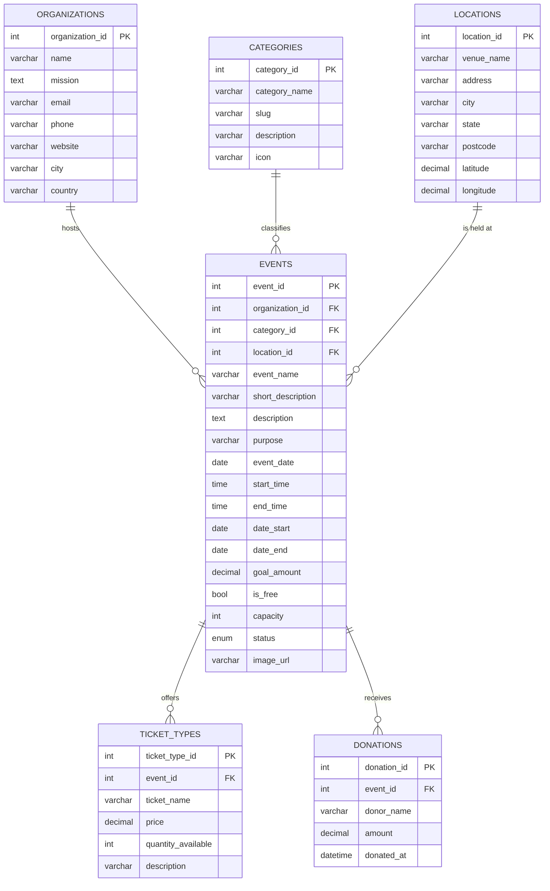

# Database design - Charity Events (`charityevents_db`)

PROG2002 Web Development II - Assessment 2, Part 1 (15%)

---

## 1. Why this design

The case study needs a website that can:

* list currently available and **upcoming** charity events on the home page,
* mark events as **past** based on their dates and today's date,
* **hide suspended** events that breach policy,
* let visitors **search** by date, location and category,
* show **full detail** for one event including **ticket information** and
  **goal vs. progress** for a fundraising target,
* identify which **charitable organisation** runs each event and which
  **category** it belongs to.

Each of those needs maps onto a table or a view, which is what drove the schema
below. Three lookup tables hold values that repeat (`organizations`,
`categories`, `locations`), one table holds the main resource (`events`), and
two child tables hold repeating detail about an event (`ticket_types`,
`donations`).

---

## 2. Entity relationship diagram



### Text version of the same diagram

```
   +----------------+          +----------------+          +----------------+
   | organizations  |          |  categories    |          |   locations    |
   +----------------+          +----------------+          +----------------+
   | organization_id|          | category_id    |          | location_id    |
   | name           |          | category_name  |          | venue_name     |
   | mission        |          | slug           |          | address / city |
   | email / phone  |          | description    |          | state/postcode |
   +--------+-------+          +--------+-------+          +--------+-------+
            | 1                         | 1                         | 1
            |                           |                           |
            | hosts                     | classifies                | is held at
            |                           |                           |
            | N                         | N                         | N
   +--------+---------------------------+---------------------------+--------+
   |                                  events                                |
   | event_id (PK) | organization_id (FK) | category_id (FK) | location_id (FK)|
   | event_name | short_description | description | purpose                 |
   | event_date | start_time | end_time | date_start | date_end                |
   | goal_amount | is_free | capacity | status | image_url                    |
   +--------+----------------------------------------------+----------------+
            | 1                                            | 1
            |                                              |
            | offers                                       | receives
            |                                              |
            | N                                            | N
   +--------+----------------+                  +----------+-----------------+
   |      ticket_types       |                  |         donations          |
   | ticket_type_id (PK)     |                  | donation_id (PK)           |
   | event_id (FK)           |                  | event_id (FK)              |
   | ticket_name | price     |                  | donor_name | amount        |
   | quantity_available      |                  | donated_at                 |
   +-------------------------+                  +----------------------------+
```

---

## 3. Table dictionary

### 3.1 `organizations`
The charitable organisations that host events.

| Column | Type | Key | Notes |
| --- | --- | --- | --- |
| `organization_id` | INT UNSIGNED | PK, auto | Surrogate key |
| `name` | VARCHAR(150) | UNIQUE | Organisation name |
| `mission` | TEXT | | Mission statement shown on the site |
| `email` | VARCHAR(150) | | CHECK enforces an `@` and a dot |
| `phone` | VARCHAR(30) | | Optional |
| `website` | VARCHAR(200) | | Optional |
| `city` | VARCHAR(100) | | Head office city |
| `country` | VARCHAR(100) | | Defaults to Australia |
| `created_at` | TIMESTAMP | | Audit column |

### 3.2 `categories`
Event types: fun run, gala dinner, silent auction, concert, food drive, golf
day, art exhibition, virtual challenge.

| Column | Type | Key | Notes |
| --- | --- | --- | --- |
| `category_id` | INT UNSIGNED | PK, auto | |
| `category_name` | VARCHAR(80) | UNIQUE | Displayed as a chip on each card |
| `slug` | VARCHAR(80) | UNIQUE | URL-friendly name |
| `description` | VARCHAR(255) | | One line explanation |
| `icon` | VARCHAR(40) | | Icon key used by the front end |

### 3.3 `locations`
Normalised venue information, so the same venue is never typed twice.

| Column | Type | Key | Notes |
| --- | --- | --- | --- |
| `location_id` | INT UNSIGNED | PK, auto | |
| `venue_name` | VARCHAR(150) | UNIQUE with city | |
| `address` | VARCHAR(200) | | Street address |
| `city` | VARCHAR(100) | INDEX | The search filter uses this |
| `state` | VARCHAR(50) | | NSW / QLD / NT / AUS |
| `postcode` | VARCHAR(10) | | |
| `latitude` / `longitude` | DECIMAL(9,6) | | Ready for a future map view |

### 3.4 `events` (the main resource)

| Column | Type | Key | Notes |
| --- | --- | --- | --- |
| `event_id` | INT UNSIGNED | PK, auto | Passed in the URL as `event.html?id=` |
| `organization_id` | INT UNSIGNED | FK | RESTRICT on delete |
| `category_id` | INT UNSIGNED | FK | RESTRICT on delete |
| `location_id` | INT UNSIGNED | FK | RESTRICT on delete |
| `event_name` | VARCHAR(180) | | |
| `short_description` | VARCHAR(300) | | Used on the summary cards |
| `description` | TEXT | | Full description on the detail page |
| `purpose` | VARCHAR(300) | | The cause the money supports |
| `event_date` | DATE | | The headline date shown to visitors |
| `start_time` / `end_time` | TIME | | CHECK `end_time > start_time` |
| `date_start` / `date_end` | DATE | INDEX | The window used to derive past / upcoming |
| `goal_amount` | DECIMAL(12,2) | | Fundraising target, CHECK `>= 0` |
| `is_free` | TINYINT(1) | | Free events shown as "Free entry" |
| `capacity` | INT UNSIGNED | | NULL = no limit |
| `status` | ENUM | INDEX | `active`, `suspended`, `cancelled` |
| `image_url` | VARCHAR(400) | | Category artwork file name |
| `created_at` / `updated_at` | TIMESTAMP | | Audit columns |

**Why two date pairs?** `event_date` is the simple date a visitor reads, while
`date_start`/`date_end` describe the full window. A one-day fun run has the
same value in all three; the three-week art exhibition has
`date_start = 2026-12-04` and `date_end = 2026-12-20`, so the website can say
"On now" while it is running instead of pretending it has not started.

### 3.5 `ticket_types`
Price tiers per event. A price of `0.00` is a legitimate free tier, which is
how the brief's "the price, or even a free one" is satisfied.

| Column | Type | Key | Notes |
| --- | --- | --- | --- |
| `ticket_type_id` | INT UNSIGNED | PK, auto | |
| `event_id` | INT UNSIGNED | FK | CASCADE on delete |
| `ticket_name` | VARCHAR(100) | UNIQUE with event | e.g. "10 km Timed Run" |
| `price` | DECIMAL(10,2) | | CHECK `>= 0`, `0.00` = free |
| `quantity_available` | INT UNSIGNED | | NULL = unlimited |
| `description` | VARCHAR(255) | | What the tier includes |

### 3.6 `donations`
Recorded gifts towards an event, which produce the "Goal vs. Progress" figures.
Assessment 2 only reads these rows; creating them is Assessment 3 work.

| Column | Type | Key | Notes |
| --- | --- | --- | --- |
| `donation_id` | INT UNSIGNED | PK, auto | |
| `event_id` | INT UNSIGNED | FK | CASCADE on delete |
| `donor_name` | VARCHAR(120) | | Defaults to "Anonymous" |
| `amount` | DECIMAL(10,2) | | CHECK `> 0` |
| `donated_at` | DATETIME | | Defaults to now |

---

## 4. The two views

### 4.1 `vw_event_progress`
Totals the donations per event and works out the percentage.

```sql
ROUND(SUM(d.amount) / e.goal_amount * 100, 1)
```

`raised_amount` and `progress_percent` are exposed by a view rather than a
`GENERATED` column, because MySQL does not allow a generated column to read
another table. Keeping them here means every endpoint reports the same figure.

### 4.2 `vw_public_events`
Joins `events` to its three lookup tables and to `vw_event_progress`, and adds
the derived state:

```sql
CASE
  WHEN e.date_end   < CURDATE() THEN 'past'
  WHEN e.date_start <= CURDATE() THEN 'ongoing'
  ELSE 'upcoming'
END AS event_state
```

Crucially it also contains `WHERE e.status = 'active'`. Every public endpoint
selects from this view, so:

* a **suspended** event cannot leak onto the home page, the search page or the
  detail page - even if a future endpoint forgets to filter;
* **past** events are excluded from the home page by adding
  `event_state <> 'past'`, and can be shown on purpose with `state=all`.

---

## 5. Data integrity decisions

| Decision | Reason |
| --- | --- |
| `ON DELETE RESTRICT` for the three event FKs | An organisation, category or location in use must not disappear |
| `ON DELETE CASCADE` for `ticket_types` and `donations` | These rows have no meaning without their event |
| `UNIQUE (venue_name, city)` | Stops the same venue being created twice |
| `UNIQUE (event_id, ticket_name)` | Stops duplicate price tiers on one event |
| `CHECK (date_end >= date_start)` | Rejects impossible date windows |
| `CHECK (end_time > start_time)` | Rejects impossible times |
| `CHECK (goal_amount >= 0)`, `CHECK (price >= 0)`, `CHECK (amount > 0)` | Rejects negative money |
| `CHECK (email LIKE '%_@_%._%')` | Basic shape check at the database level |
| `utf8mb4` / `utf8mb4_0900_ai_ci` | Correct storage and comparison for all names, and the same default collation that MySQL 8.0+ uses, so string comparisons in views never raise "illegal mix of collations". On MySQL 5.7 replace this with `utf8mb4_unicode_ci` |
| Indexes on `date_start/date_end`, `status`, and each FK | The filter columns are the ones the API queries |

Validation is deliberately done in **three** layers, which is worth explaining
in the video:

1. the **client** checks the form so the visitor gets instant feedback,
2. the **API service layer** validates every query parameter and returns a 400
   with field-level details,
3. the **database** enforces types, keys, uniqueness and CHECK constraints.

---

## 6. Sample data

`02_seed.sql` inserts:

* **6** charitable organisations
* **8** event categories
* **9** locations (including an online venue)
* **11** events - that is the required minimum of 8 plus extras:
  * 8 active events that are upcoming or running
  * 2 active events in the past (a completed gala and fun run), so the
    past/upcoming rule is visibly exercised
  * 1 **suspended** event (id 11) which must never appear on the public site
* **18** ticket tiers, including free tiers on the fun run, food drive and art
  exhibition
* **42** donations, so every progress bar shows a realistic figure

The seed dates are spaced around the assessment due date (28 September 2026) so
the home page always shows a believable mix of upcoming and past events.

---

## 7. Reproducing the database

```sql
-- MySQL Workbench: File > Open SQL Script > database/charityevents_db.sql
-- then click the lightning bolt to run the whole script.
```

Or from a terminal:

```bash
mysql -u root -p < database/charityevents_db.sql
```

Verify the result:

```sql
USE charityevents_db;
SELECT COUNT(*) AS events FROM events;                       -- 11
SELECT event_state, COUNT(*) FROM vw_public_events GROUP BY event_state;
SELECT event_name, raised_amount, goal_amount, progress_percent
  FROM vw_public_events ORDER BY progress_percent DESC;
```
